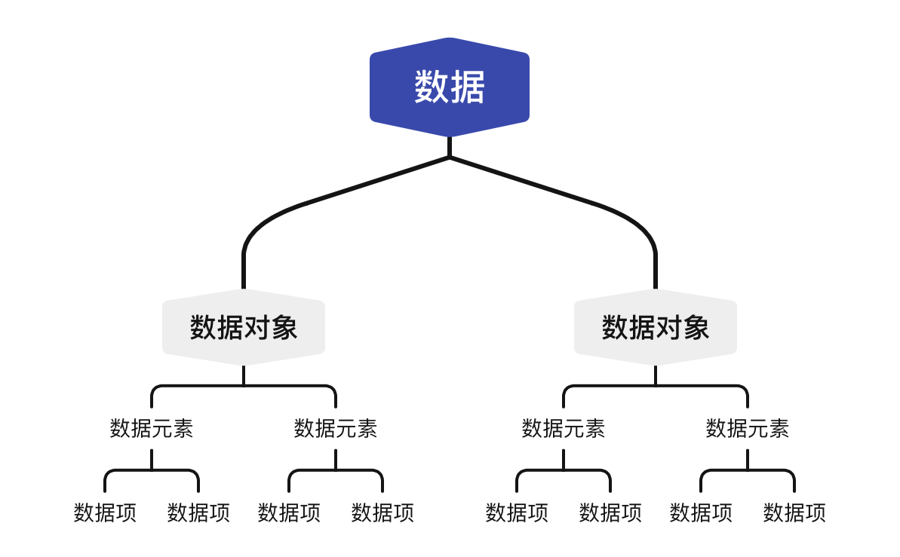

> Preface:
> 
> 1. 本篇所有代码均由 C++ 实现
> 
> 2. 参考文献：
>   * 大话数据结构（程杰）
>   * 数据结构考研指导（王道论坛）


# 数据结构_绪论

## 数据结构

### 基本概念

数据：描述客观事物的符号，计算机的可操作对象，是一个整体的概念。

**数据元素**：组成数据的基本单位，如数组的一项。

数据对象：相同性质的数据元素的集合，是数据的子集合。

数据项：数据不可分割的最小单位。

**数据结构（data structure）**：相互之间存在一种或多种特定关系的数据元素的集合。

四者关系可以如此表示：



### 逻辑结构：数据元素之间的相互关系

**集合结构**  
数据元素除了同属一个集合外没有其他关系。

**线性结构**  
数据元素是一对一关系，除第一个元素外均有唯一前驱，除最后一个元素外均有唯一后继。

**树形结构**  
数据元素是一对多关系，有唯一的前驱和多个后继。

**图装结构**   
数据元素是多对多关系。

### 数据运算

数据的查找、插入和删除等操作。

### 数据的物理结构

数据的存储结构影响着数据运算的效率和可行性。

> 此部分知识在[操作系统_文件管理](操作系统_文件管理.md)章节有详细说明。  

顺序存储：数据元素存放在连续的存储单元中。

非顺序存储：链式存储、索引存储、散列存储。
 
### 抽象数据类型

抽象数据类型（abstract data type，ADT）是数学的抽象、对实现原理的抽象，即使用者只关心数据对象和相关的操作 **“是什么”**，而不关心 **“如何实现”**。

如 C语言中的结构体（struct）、C++/Java/Python 中的类（class）等。

换言之，对于一门计算机语言来说，只要不是基本数据类型，即为抽象数据类型。  

>拓展：同样采取抽象思想的还有应用程序接口（application programming interface，API）。

## 算法

算法（algorithm）是处理问题的方法、步骤，不仅涉及计算机科学，在计算机中是由程序实现，如函数、方法、类或是整个程序框架。

算法的特性：有穷性、可行性、确定性。

算法设计的要求：正确性、可读性、健壮性、时间效率高和存储量低。
 
## 算法效率的度量

### 算法的时间复杂度

算法的时间复杂度即事先预估算法的时间开销与问题规模 n 的关系。

```cpp
void func(int n) {
    int i = 1; // 1
    while (i <= n) { // n+1
        i++; // n
        std::cout << “Hello”; // n
    }
    std::cout << “World\n”; // 1
}
```

上述程序的时间复杂度为 T(n) = 3n+3.

**大O表示法**  
上限表示法，即算法在最坏的情况下的时间复杂度。

$$
T(n)=O(f(n)) \Leftrightarrow \lim_{n \to \infty} \frac{T(n)}{f(n)}=c(c\text{为常数}).
$$

故上述算法的时间复杂度为 T(n) = O(n).

常见算法的时间复杂度（从小到达排列）:

$$
O(1)<O(log_2n)<O(n)<O(n^2)<O(n^3)<O(2^n)<O(n!)<O(n^n).
$$

算法的时间复杂度相加，只保留最高阶的项。

$$
T(n)=T_1(n)+T_2(n)=O(f(n))+O(g(n))=O(max(f(n),g(n)))
$$

### 算法的空间复杂度

程序的指令和数据存储在内存中，算法的空间复杂度即为程序占内存的大小与问题规模 n 的关系。

```cpp
void func(int n) {
    int array[n]; // n Byte
    int i; // 4 Byte
}
 ```

以上代码的空间复杂度为 S(n) = n+1，同样使用大O表示法，则 S(n) = O(n).

递归函数调用的内存开销：

```cpp
void func(int n) {
    int i, j; // 8 Byte
    func(n - 1);
    if (n == 1)
        return; // 函数递归调用 n 次
}
```

该函数递归调用 n 次，每次在内存中增加两个 int 型变量，故 S(n) = O(n).

若将程序改为：

```cpp
void func(int n) {
    int array[n]; // n Byte
    func(n - 1);
    if (n == 1)
        return; // 函数递归调用 n 次
}
```

则函数每次调用需在内存中增加一个 int 型数组，从 n 到 1 数组的长度分别为 n, n-1, … , 1，则总的长度为 $\frac{1}{2}(n^2+n)$，故 S(n) = O(n<sup>2</sup>).
